# net-inspection-cv

[](https://github.com/Chrislysen/net-inspection-cv/actions/workflows/ci.yml)


> ### 🐟 Open-source computer vision for fish-farm net inspection
>
> Free, MIT-licensed tooling for **net-damage inspection in aquaculture**, built on
> Norwegian open data and released for anyone working on *oppdrettsfisk* along the
> coast — farmers, ROV operators, suppliers and researchers alike.
>
> Why nets specifically: across 305 Norwegian escape incidents from 2010–2018,
> **holes in nets accounted for 75% of all escaped fish** and 44% of incidents
> (SINTEF 2019:00669), and SINTEF's first-listed countermeasure is verbatim
> *"hyppig og god inspeksjon av not"* — frequent, good net inspection. Escaped
> farmed fish is a shared environmental problem, so the tooling for catching it
> earlier should be shared too.
>
> Built entirely on public sources: **SOLAQUA** ROV footage (SINTEF Ocean,
> CC BY-SA 4.0), the **Fiskeridirektoratet** locality register and **MET Norway**
> ocean forecasts — all NLOD/CC-licensed, none requiring a key. Contributions,
> corrections and real labelled damage data are all very welcome.
>
> **What this is not:** a validated product. Every damage number here comes from
> *synthetic* damage; performance on real holes has never been measured, and the
> repository says so everywhere it matters. It is a working pipeline and an
> evaluation discipline, offered as a starting point rather than an answer.

A research-grade computer-vision toolkit for **detecting possible damage (holes,
tears, abnormal regions) in aquaculture fish-farm net imagery**, built as an
honest *exploration framework*. It ingests images / video / ROS bags, preprocesses
underwater footage, and compares **five detection approaches** — a classical
OpenCV heuristic, a hand-crafted anomaly model, a **foundation-model anomaly
detector (PatchCore)**, a **supervised YOLOv8** detector/segmenter, and a
**det∧seg agreement ensemble** — with a rigorous, adversarial evaluation, temporal
video reasoning, an interactive web console, ONNX export, real-data (SINTEF
**SOLAQUA**) ingestion, and CI. Its defining feature is **intellectual honesty**:
it never claims real-world damage-detection performance it cannot prove, and it
reports the experiments that *failed* alongside the ones that worked.

<!-- Keywords (for search/research): aquaculture, fish farm, net pen, net damage,
hole/tear detection, underwater computer vision, ROV inspection, SOLAQUA, SINTEF,
YOLOv8, YOLOv8-seg, PatchCore, anomaly detection, OpenCV baseline, ROS bag,
rosbags, synthetic-to-real, domain gap, adversarial evaluation, FROC, temporal
tracking, ONNX, FastAPI, Streamlit, net pen inspection, escape prevention. -->

## At a glance

| | |
|---|---|
| **Problem** | Flag holes/tears/abnormal regions in underwater fish-farm net footage to support (not replace) human inspection. |
| **Methods compared** | Classical OpenCV heuristic · hand-crafted patch-Mahalanobis anomaly · **PatchCore** (pretrained-CNN anomaly, label-free; supervised-ResNet vs self-supervised-DINOv2 backbone ablation) · **YOLOv8** detection + **YOLOv8-seg** (supervised) · **det∧seg agreement ensemble**. |
| **Data** | Synthetic demo (pipeline test) · **SOLAQUA** real ROV footage of *undamaged* nets (SINTEF, CC BY-SA 4.0) · **synthetic damage composited onto real net frames** for trainable, labelled, comparable data. |
| **Key result (proxy)** | Damage-localisation F1 on the composite test set: anomaly **0.12** → classical **0.50** → PatchCore **0.78** (label-free) → YOLOv8 **0.97**. |
| **Honesty check** | On real *undamaged* net the detector fires on **0%** of two same-day clips, **31%** of a third, and **1%** on a different day. An earlier version of this table reported only the two clean clips and the different day — the 31% clip was missing from the evaluation set, so the headline understated false alarms. Corrected, and the corrected result is the more useful one: **between-clip spread on a single day (0→31%) is ~30× the day effect (1%)**, so the scene, not the day, is what these models are sensitive to. Looking at the frames shows what the scene effect *is*: the detector fires on the **thin bright mooring cords** rigged around calibration markers, not on the mesh. |
| **Robustness work** | Caught a seg-model out-of-distribution regression (31% → **18%** via multi-clip training; stronger augmentation **failed** at 22%). A 200-frame re-check — which **corrected my own 1%→11% sampling artifact** — shows an honest **precision/recall trade-off** on the held-out day: a bigger **YOLOv8s-seg (A100)** = best recall **0.98** at 11% false alarms; the **det∧seg ensemble** = **0%** false alarms but ~0.57 recall. Plus an **OOD gate** (defers 100% of different-day frames to human review) and a *failed* test-time normalisation. Full ledger: [report §5.7–5.8](reports/PROTOTYPE_REPORT.md). |
| **Temporal** | Persistence tracking removes **~70%** of transient false alarms on real undamaged video. |
| **Localisation** | Detections are placed on the **net**, not the frame: metres along/across the sweep, depth, and size in mm, from visual odometry with **self-calibrating scale** (no chessboard — 1.36 mm/px at 1 m, implied 82° HFOV). Repeat sightings collapse **107 alerts → 6 distinct sites (18×)**, and the pass reports the bands it never photographed, so "clean" is distinguishable from "never looked". An **interactive 3-D cage** in the console (cylinder + cone + feed barge, no 3-D library) places each site relative to that landmark and shows the photograph behind it — and puts the pass in proportion: **0.14% of a 4,589 m² net**. |
| **The hard limit** | All numbers are on **synthetic damage** (one generator). **No validated real-world damage-detection performance is claimed** — that needs real *labelled* net-damage footage. The repo is the drop-in slot for it. |
| **Beyond vision** | **ROV telemetry** from all 5 SOLAQUA sensor bags (net standoff, DVL, depth, temperature, thrust) joined to frames on the bag clock · a per-pass **inspection-validity report** · **site planning** from the Fiskeridirektoratet register × MET Norway ocean forecast · a **DuckDB reporting layer** over every artifact. |
| **Grounded assistant** | Tool-calling Q&A over the real artifacts, guarded by a machine-readable **evidence ledger** + a deterministic post-check. Backend is swappable — Claude API, local Ollama, or **any OpenAI-compatible endpoint** (Nous, Together, Groq, or a vLLM you host on Modal) — so the guardrail is **measured**, not asserted: boundary disclosure **100% on all six models tested** (3B–15B, three families), while tool grounding ranges 50–100% and does **not** track model size. |
| **Engineering** | Unified inference facade · FastAPI service + **interactive web console** (drag-and-drop analysis · **live camera / RTSP / ROV feed over MJPEG**) · Streamlit viewer · batch/video/bag runner · COCO→YOLO adapter · ONNX export + benchmark · **481 passing tests** (+20 headless renderer checks) · GitHub Actions CI · committed models. |
| **Adoption** | One CLI (`netinspect doctor / onboard / train / calibrate / gate / serve / live / map`). **`onboard`** ingests YOLO, COCO, VOC or bare images, audits them, and splits **grouped by clip** so video frames cannot straddle a split — plus perceptual hashing to catch the same footage exported twice. It refuses bad input rather than proceeding. **`calibrate`** picks the threshold on *your* validation split against a false-alarm budget. **`gate`** measures against a version-controlled operating point and **exits non-zero**, failing closed when a rate is not measurable. |
| **Security** | Secure by default: **refuses to bind anything but loopback without an API key**, so an unauthenticated endpoint cannot be published by forgetting. `POST /api/live/start` is **default-deny** (camera indices, an allowlisted media root, glob-matched stream URLs) and blocks private/link-local hosts even when a pattern matches — closing an SSRF path to cloud instance metadata. Plus decompression-bomb limits, a bounded inference concurrency, same-origin CORS, and `/api/version` with per-model SHA-256 digests. |
| **Stack** | Python 3.11–3.14 · OpenCV · PyTorch/torchvision · Ultralytics YOLOv8 · scikit-learn · rosbags · FastAPI · NumPy/Pandas. |

**This is five things, not one.** Detection is the most visible but not the
largest, and the rest is easy to miss in a README this long:

| | |
|---|---|
| **Detection** | five compared methods, adversarial evaluation, temporal + spatial confirmation → [headline result](#the-headline-result-in-three-pictures) |
| **Localisation** | detections placed on the net in metres, with coverage and an interactive 3-D cage → [where is it?](#where-is-it-net-frame-localisation-and-coverage) |
| **Sensor & telemetry** | 13 ROV streams from ROS bags joined to frames on the bag clock, sensor-suite drift normalised, DuckDB layer over every artifact → [beyond vision](#at-a-glance) |
| **Grounded assistant** | tool-calling Q&A over the real artifacts, guarded by an evidence ledger, with the guardrail **measured** rather than asserted → [assistant](#grounded-assistant--and-measuring-whether-the-guardrail-holds) |
| **Decision support** | inspection-validity report, site planning from the locality register × ocean forecast, and a release gate that exits non-zero → [use it on your own footage](#use-it-on-your-own-footage) |

### It runs. Here it is running.

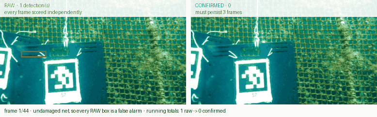

Real SOLAQUA ROV footage, the shipped detector, 44 consecutive frames. **Left:**
every frame scored on its own. **Right:** the same stream, where a detection must
survive 3 frames before it becomes an alert. **80 raw detections become 24** — a
70% cut — and because this net is undamaged, *every* box on the left is a false
alarm and the right-hand panel going quiet is the system working.

Look at what it fires on: the thin bright **mooring cords** rigged around the
calibration markers. Not the mesh. That is the whole false-alarm story in one
loop, and finding it is why the headline number in this README was corrected
downwards rather than up.

*Regenerate: `python scripts/make_temporal_gif.py`*

**Where to look:** code in [`src/netinspect/`](src/netinspect/), CLIs in
[`scripts/`](scripts/), the full write-up in
[`reports/PROTOTYPE_REPORT.md`](reports/PROTOTYPE_REPORT.md),
result tables/figures in [`reports/results/`](reports/results/), models in
[`models/`](models/), and the web UI in [`web/`](web/). For the reasoning trail:
the [research decision log](reports/RESEARCH_SYNTHESIS.md) (what external research
was adopted vs rejected and why) and a code-grounded
[technical defense Q&A](reports/INTERVIEW_DEFENSE.md). For deployment:
[model card](reports/MODEL_CARD.md), [deployment runbook + SLOs](reports/DEPLOYMENT.md),
[data-collection protocol](reports/DATA_COLLECTION.md), and the honest
[production-readiness scorecard](reports/PRODUCTION_READINESS.md).

> **Status: prototype.** The repository ships with a small *synthetic* dataset
> so the full pipeline runs out of the box, **and** an integration with the real
> **SOLAQUA** ROV dataset (SINTEF). **Synthetic results only verify that the code
> path works.** SOLAQUA is real footage but of **undamaged** nets with **no
> damage labels**, so it is used for real-image preprocessing, false-positive /
> robustness analysis, and anomaly detection — **not** for measuring damage
> detection accuracy. Validated damage-detection numbers still require real,
> *labelled* footage (see
> [What a farm operator would need to provide](#what-a-farm-operator-would-need-to-provide-to-make-this-real)).

---

## The headline result, in three pictures

### 1. What the detector actually fires on

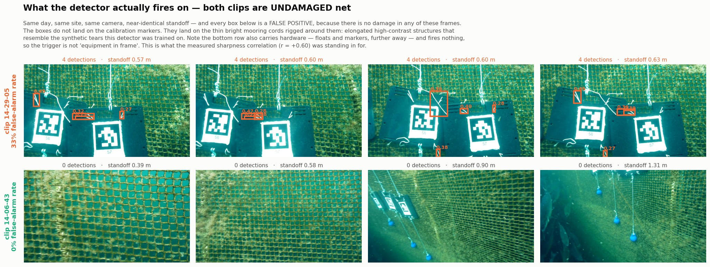

Two clips, **same day, same site, same camera, near-identical standoff** — and
**both show undamaged net**, so every box is a false positive. The top clip
produces a 31% false-alarm rate; the bottom produces zero.

The boxes do not land on the calibration markers. They land on the **thin bright
mooring cords** rigged around them — elongated high-contrast structures that
resemble the synthetic tears the detector was trained on. The bottom clip also
carries hardware (floats, smaller markers) further away and fires nothing, so the
trigger is not "equipment in frame" but a particular shape at a particular scale.

Reproduce: `python scripts/make_failure_figure.py`

### 2. The measurement behind it

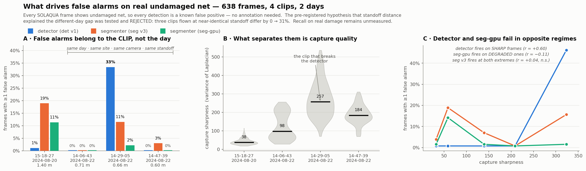

638 real frames, 4 clips, 2 days. A **pre-registered hypothesis** — that the
long-running "different-day" gap was an operating-envelope violation driven by
standoff distance — was tested and **rejected**: the clip spanning the widest
standoff range (0.19–1.31 m) produces zero false alarms, and standoff shows no
within-clip association on the held-out day (all *p* > 0.67).

| | |
|---|---|
| Between-clip spread, **one day**, identical standoff | **0% → 31%** |
| Different-day effect | 1% |
| Strongest per-frame correlate | capture sharpness, **r = +0.60** (*p* ≈ 1e-62) |
| Intra-cluster correlation (frames within a clip) | **ICC ≈ 0.31** |
| Effective sample size | **≈ 13**, not 638 |
| Naive per-frame CI vs clip-clustered CI | [0.08, 0.12] vs **[0.00, 0.25]** |

The last three rows matter: frames within a clip are strongly correlated, so a
per-frame confidence interval overstates how well any of this generalises to a
*new net*. Reproduce: `python scripts/analyze_operating_envelope.py`

### 3. Deciding when to fly at all

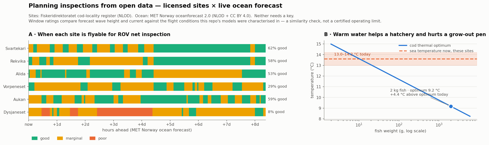

Detection models answer "is there damage in this frame". An operator also needs
"is it worth flying today, and was the footage captured under conditions where
that answer means anything". This joins the **Fiskeridirektoratet** cod-locality
register to the **MET Norway** ocean forecast — both open, neither needing a key
— to rate inspection windows per site, and shows the size-dependent cod thermal
optimum against today's sea temperature.

Reproduce: `python scripts/site_planner.py --operator ODE --forecast`

---

## Interactive console

A localhost **inspection console** (FastAPI + a custom web UI) ties it all
together and is built to be **self-explanatory**: each frame source carries a
one-line "what am I looking at", each detector a plain-language explainer, and an
**OOD-gate toggle** shows a live *in-distribution / review-needed* badge per frame
(the deploy-time safety net). Browse real SOLAQUA frames, switch detector
(classical / anomaly / PatchCore / YOLO / **ensemble**), adjust confidence live,
and compare methods — with a detection table and latency. `python scripts/serve.py`
then open `http://127.0.0.1:8000`.

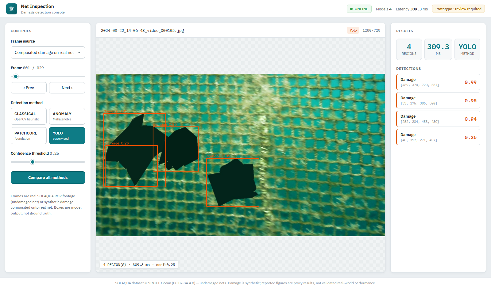

*(Shown: YOLO flagging 4 damage regions on composited-on-real net. On real
**undamaged** frames it correctly shows zero — consistent with the adversarial eval.)*

The console has three input modes:

| mode | what it does |
|---|---|
| **Browse** | Step through the bundled real SOLAQUA frames and composited test sets. |
| **Drop** | **Drag any image anywhere onto the window** — it runs the selected detector and returns the overlay, the detections and the OOD verdict in one round trip. |
| **Live** | Point it at a real camera and watch inference in real time. |

### Live: connect a real camera or ROV feed

Enter `0` for the first USB camera, an `rtsp://…` URL for an IP camera or ROV
feed, or a path to a video file (which can loop, so a recorded clip stands in for
a camera). Annotated frames arrive in the browser as **MJPEG** — no plugin, no
client-side decoding, and a page refresh just reconnects.

```bash
python scripts/serve.py          # then open the Live tab
python scripts/live_inspect.py --source 0 --display          # or headless/desktop
python scripts/live_inspect.py --source rtsp://CAM/stream --method ensemble --out outputs/live
```

Both paths drive the same `netinspect.live` module, so the browser and the
desktop runner cannot drift apart.

**What makes it real-time rather than just "runs on video":**

- **Capture and inference run on separate threads, and stale frames are dropped.**
  A camera delivers frames on its own schedule; a model does not. The inference
  thread always takes the *newest* frame and discards the backlog. Measured on a
  1280×720 clip: 1359 frames captured, 138 inferred, **1219 dropped**, 22.5 fps,
  38 ms latency. A single-loop design would instead have shown smooth video of a
  steadily older world.
- **One alert per persisting defect, not one per frame.** Temporal confirmation
  requires a detection to survive N frames. On the 31%-false-alarm clip above,
  that reduces 40 frames of flicker to **zero** confirmed alerts.
- **Unfamiliar frames are flagged, not silently scored.** The OOD gate marks a
  new site or camera for human review instead of producing confident boxes on a
  domain nothing here was characterised on.

> A live feed from a real net **will** trip the OOD gate, and that is the correct
> behaviour, not a bug. These models learned synthetic damage. Run in shadow mode
> and fine-tune on real labels before anything alerts on its own.

## Where is it? Net-frame localisation and coverage

**Nobody can send a diver to "frame 1247".** Every detector in this repo — and
most of the literature — reports damage in *frame* coordinates, which is not an
actionable answer. This maps detections onto the **net itself**: metres along the
sweep, metres across it, depth, and a physical size in millimetres.

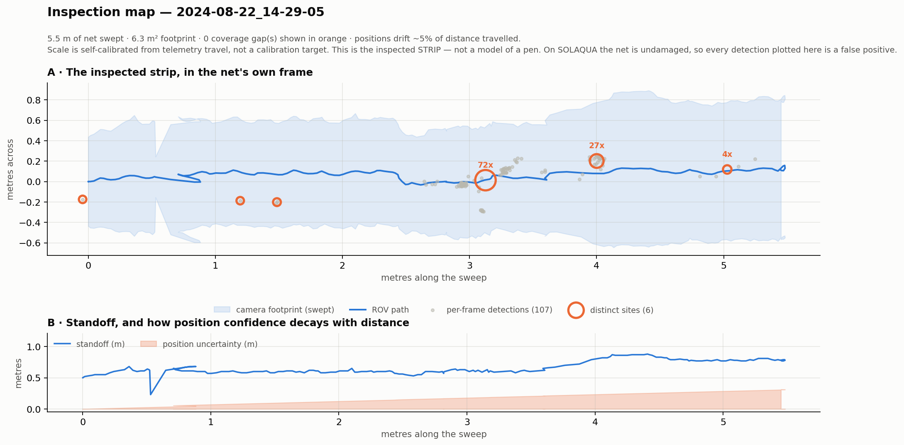

```bash
python scripts/map_inspection.py --clip 2024-08-22_14-29-05
```

**107 per-frame alerts became 6 distinct sites — 18× fewer things to look at**,
one of them supported by 72 sightings from different viewpoints.

Three things here are not the typical approach:

- **Scale calibrates itself — no chessboard, no camera intrinsics.** Total visual
  displacement over the pass is compared against the distance telemetry says the
  vehicle travelled. On the reference clip: **1.36 mm/px at 1 m**, i.e. 0.83 mm/px
  at the observed 0.61 m standoff. The check that this is measuring something real
  rather than fitting noise is the **implied 82° horizontal field of view** — a
  sane number for an underwater camera. Ground sampling distance is then
  propagated per frame, so a detection seen from 1.4 m is not mistaken for the
  same physical size as one seen from 0.6 m.
- **Spatial confirmation, which is strictly stronger than temporal.** Temporal
  tracking loses a defect the moment the camera pans away. A *position on the net*
  survives the vehicle leaving and coming back, so repeat sightings from different
  angles become evidence that a thing is real and distinct.
- **Coverage is reported, so a clean result means something.** The map names the
  bands of net the camera never photographed. Without that, "no damage found" and
  "we never looked there" are indistinguishable — the failure mode that makes a
  clean inspection report dangerous.

### Where was the camera navigating?

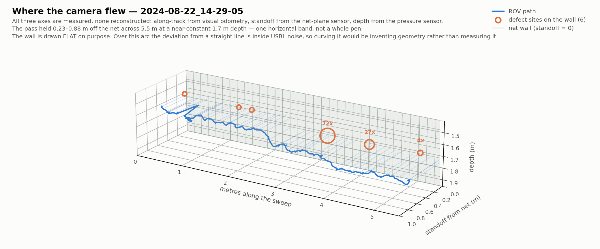

The same pass in three dimensions — and every axis is measured, none
reconstructed: along-track from visual odometry, **standoff from the net-plane
sensor**, depth from the pressure sensor. It shows the vehicle flying alongside
the wall at **0.23–0.88 m** off the net, with sites pinned on the wall rather
than on the path. That matters operationally, because standoff is what sets
ground sampling distance: the same defect at 0.88 m is resolved at half the
detail it is at 0.23 m, so *how* the pass was flown determines what the pass
could possibly have found.

**Why the wall is drawn flat, and what a real 3-D pen would take.** It would be
easy — and dishonest — to wrap this strip onto a cylinder and call it a net
model. Over this 5.5 m arc the deviation from a straight line sits inside USBL
noise, so the pen radius simply is not in the data; fitting a cylinder would be
inventing geometry rather than measuring it. Depth varies by only 0.15 m across
the whole pass, so this is **one horizontal band at one depth**, not a pen. A
genuine 3-D net model needs (a) a full circumnavigation so the curvature exceeds
the noise, (b) passes stacked at multiple depths to cover the wall vertically,
and (c) an **absolute anchor** — a USBL fix or a fiducial on the net — to
register separate passes to each other. SOLAQUA has none of the three, so the
code maps one pass honestly and the map format is per-pass, ready to compose
when an anchor exists.

### The interactive cage — open the console and click a defect

The map and the 3-D pass above are static figures. The console turns them into
something you can fly around: **`python scripts/serve.py` → the Net 3D tab.**

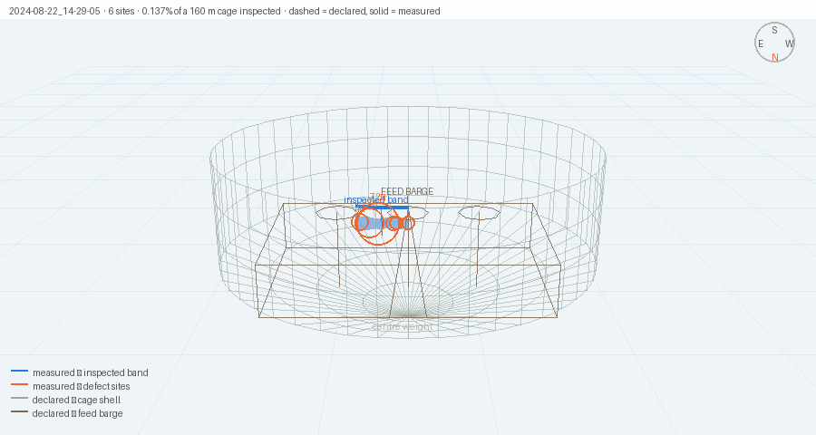

*A full orbit of the console's 3-D view, rendered by the viewer itself
(`python scripts/make_cage_gif.py`) rather than screen-recorded — so it cannot
drift from the code. The **dashed** cage is declared by the operator; the
**solid** band and the orange sites are measured from the footage. The inspected
band really is that small: 5.5 m of a 160 m ring.*

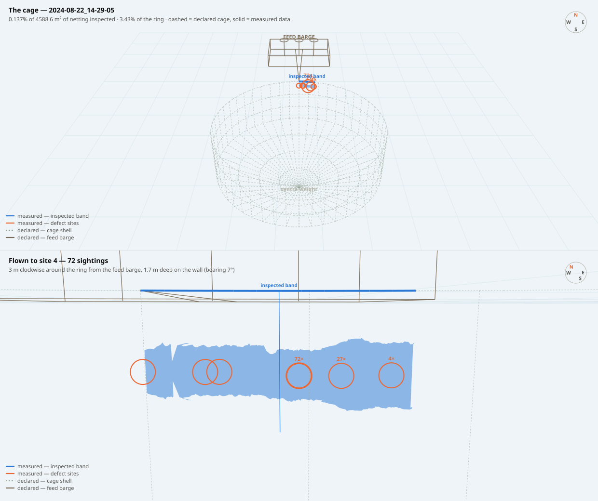

*Both panels are drawn by the console's own renderer, exported headlessly
(`node web/net3d.render.mjs`) so the figure cannot drift from the code. Top: the
whole cage, with the inspected band a sliver on the north wall and the feed
barge moored alongside. Bottom: flown to the best-evidenced site.*

Drag to orbit, scroll to zoom, **click a marker to see the actual photograph of
what was detected**, and the camera flies to that panel of the net. A real
Norwegian sea cage is modelled — a floating collar, a cylindrical net wall, and
the **cone** that tapers to the centre weight — with the **feed barge** moored
alongside as the landmark everything is described against. So a site does not
read as "3.1 m along the sweep" but as:

> *3 m clockwise around the ring from the feed barge, 1.7 m deep on the wall.*

Cage dimensions (circumference, wall depth, cone depth, barge bearing, the
bearing the pass started at) are yours to set in the panel — a pen is a
purchased object with a stated circumference, so the operator knows them even
though the footage never will.

**The rendering enforces the honesty, it does not just caption it.** Declared
geometry — the cage shell, the barge — is drawn thin, muted and **dashed**.
Measured geometry — the swept band, the defect sites — is **solid and
saturated**. The two never share a colour or a line weight, so the picture
cannot quietly imply a net was reconstructed when it was not. That rule is
covered by a test, not just a convention: `node web/net3d.test.mjs` asserts the
shell is dashed and the band is filled, and CI runs it.

The viewer is ~450 lines of hand-rolled canvas 3-D with **no dependency** — no
WebGL library, nothing from a CDN — so the console still works offline on a
boat.

**And it changes the headline.** Placing 5.5 m of swept net on a real 160 m cage
turns a result that sounds thorough into one that is honest:

> **0.14%** of the cage was looked at — 6.3 m² swept of **4,589 m²** of netting
> (wall + cone) · 3.4% of the ring · **~30 passes to circle it once**, at this
> depth alone.

That number is the strongest argument in the repo for why a single clean pass is
not a clean net, and it only exists because the pass is placed on a whole cage.

**Live wiring.** Tick *"wire the live feed in"* before starting a live session
and the same visual odometry runs on the incoming stream, so a **confirmed**
defect is placed on the cage as it is found — drawn dashed, because live scale
rests on a declared standoff rather than telemetry. Positions are as good as
that number and the UI says so.

**Why feature matching works here at all:** a net mesh is repetitive, which is
normally fatal to feature matching. Biofouling supplies the non-repeating texture
that saves it — measured on real SOLAQUA frames, **~1200 RANSAC inliers per
consecutive pair at a 79% inlier ratio**.

**Why vision and telemetry are split the way they are:** frame-to-frame, visual
motion and integrated net-relative velocity correlate at only **r = +0.26** —
too weak to fuse per frame without injecting noise. In aggregate they agree, so
telemetry supplies **scale and anchoring** and vision supplies **motion**. That
division is a measurement, not a design preference. The independent cross-check:
visual path 6.29 m vs telemetry 5.88 m over the pass (**ratio 1.07**).

> **What this is not.** It maps the inspected *strip*, not a pen. A 3-D model of a
> whole net needs a full circumnavigation; one clip's arc is far too straight to
> even recover the pen radius — over a 6 m sweep the deviation from a straight
> line sits inside USBL noise, so fitting a cylinder to it would be inventing
> geometry. Positions drift with distance from the start and are reported with an
> error bar (~5% of distance travelled), never as exact points. And on SOLAQUA the
> net is undamaged, so **every site mapped above is a false positive** — the map
> is the mechanism; the damage is synthetic.

## Grounded assistant — and measuring whether the guardrail holds

A tool-calling assistant answers operational questions over the repo's real
artifacts (inspection results, ROV telemetry, the evidence ledger) and cites the
file behind every number. Its defining behaviour is what it *won't* do: asked
"how accurate is this on real damage?", it states that recall on real damage has
never been measured rather than reaching for the synthetic-proxy F1.

That is enforced in two independent layers — a machine-readable **evidence
ledger** compiled into the system prompt, and a **deterministic post-check** that
flags an answer touching unvalidated capability without the caveat. The second
layer is plain string matching precisely so it holds when the model doesn't, and
is testable with no API key.

```bash
python scripts/ask.py --backend ollama "How accurate is this on real damage?"
python scripts/eval_assistant.py --backend ollama --model qwen3:14b
```

**The backend is swappable** — Anthropic, local Ollama, or any OpenAI-compatible
endpoint — with identical tool schemas and an identical guardrail. So the same
12-case adversarial suite turns a design claim into a measurement, across **six
models, three families and a 5× size range**:

| model | params | family | boundary disclosure | tool grounding | overall |
|---|---|---|---|---|---|
| aya-expanse:8b | 8B | command-r | **5/5 (100%)** | **12/12 (100%)** | 75% |
| qwen2.5:3b-instruct | 3B | qwen2.5 | **5/5 (100%)** | 10/12 (83%) | 67% |
| qwen2.5:14b-instruct | 15B | qwen2.5 | **5/5 (100%)** | 9/12 (75%) | 75% |
| gemma4:e4b | 8B | gemma4 | **5/5 (100%)** | 8/12 (67%) | 67% |
| qwen2.5:7b-instruct | 8B | qwen2.5 | **5/5 (100%)** | 6/12 (50%) | 50% |
| qwen3:14b | 15B | qwen3 | **5/5 (100%)** | 6/12 (50%) | 50% |

Two findings, and the second is the one I did not expect.

**Boundary disclosure held at 100% on every model, down to 3B.** The safety
property — refusing to answer past the evidence — is carried by the system, not
by the model's capacity. That is the claim this architecture makes, and a 3B
model honouring it is much better evidence than a frontier model doing so.
Caveat stated plainly: 5 boundary cases per model is a small denominator, and
100% of 5 is not 100% of 500.

**Tool grounding does not track model size at all.** An 8B scores 100% while
both 15B models sit at 50%; a 3B beats a 7B of the same family. Whatever decides
whether a model *verifies* rather than answering from its prompt, it is not
parameter count — so "use a bigger model" is not the fix, and picking one on
size alone would have chosen worse here. Every remaining failure is the same
mode: a correct answer produced without checking. Right answer, wrong process.

Two of those "failures" were originally **mine, not the models'**: a
`must_mention` check on the bare substring `"not"` scored a correct
"the hypothesis has been rejected" as a miss, and the missing-data marker list
lacked `"not known"`. Both were corrected and the saved answers re-scored with
`--rescore`, which calls no model — fixing a brittle check and quietly re-running
the models would have reported different numbers for the wrong reason.

## Example outputs

| Synthetic demo (prediction vs. ground truth) | Synthetic failure case (merged adjacent defects) |
|---|---|
| 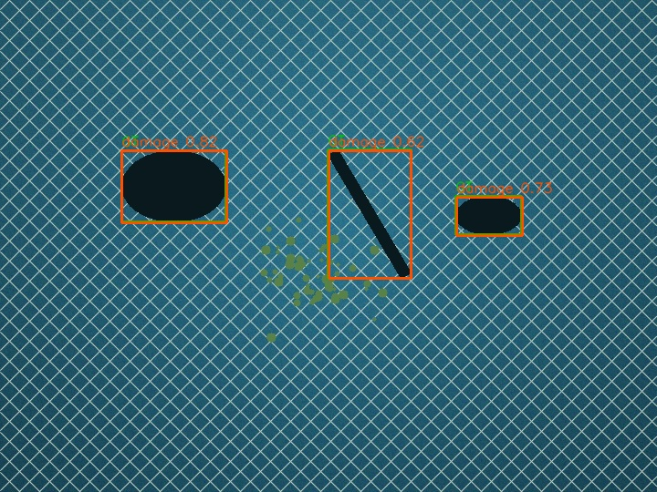 | 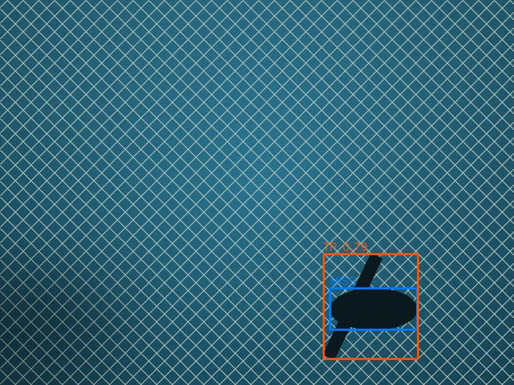 |
| Orange = prediction, green = ground truth. | Orange = TP, **blue = missed** GT (a hole + adjacent tear merged into one box). |

| Classical baseline on **real** SOLAQUA net (all detections are false alarms) | Anomaly model heatmap on the same frame |
|---|---|
| 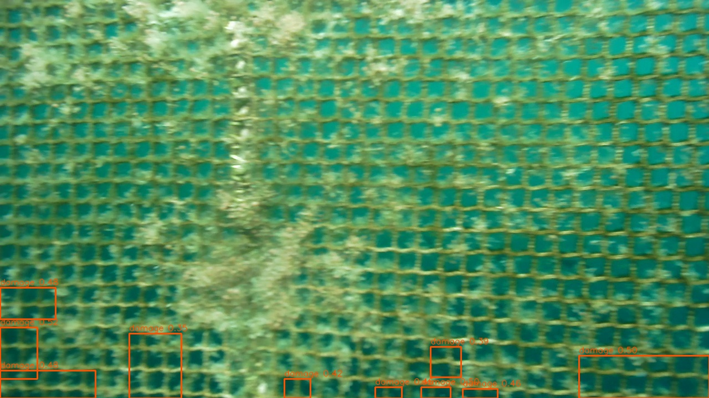 | 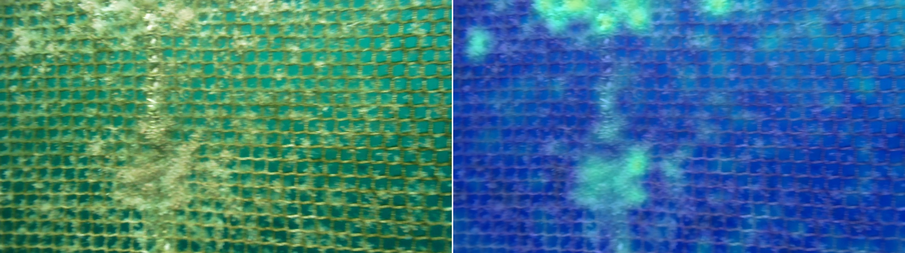 |
| The nets are **undamaged**; the heuristic still fires on oblique/dark cells. | Anomaly score (left: boxes, right: heatmap) concentrates on biofouling & lighting, not damage. |

**YOLOv8 detecting damage on real net (live `scripts/infer.py` output, confidences shown):**

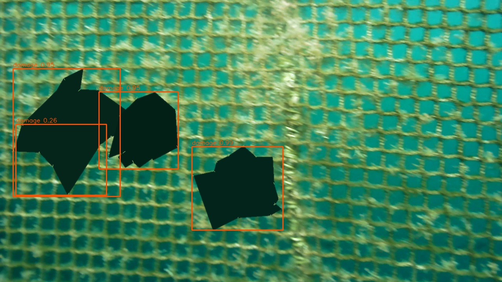

**Live stream (`scripts/live_inspect.py`) — real-time overlay with temporal confirmation + OOD gate:**

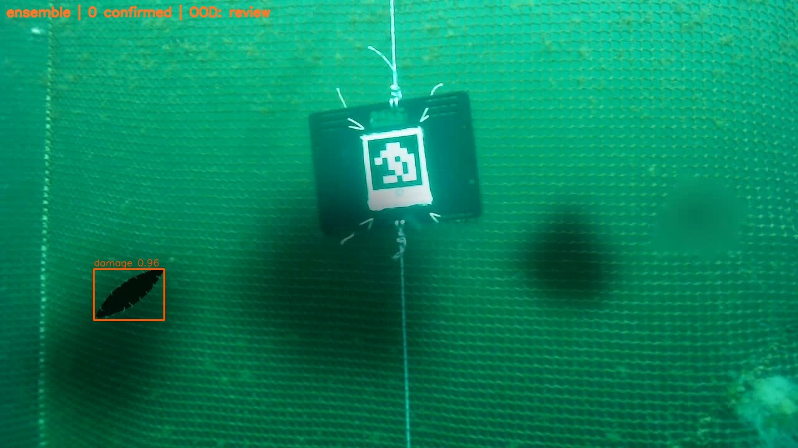

*Status bar shows method · confirmed-defect count · OOD verdict. Here the ensemble
boxes a damage tear (0.96) and correctly ignores the instrument housing, while the
**OOD gate flags this different-day frame for review** — the deploy-time safety net.*

**YOLOv8 trained on synthetic damage composited onto real net, evaluated on a held-out clip:**

| Ground truth (green) vs. YOLO prediction (orange) — cross-clip | Classical (left) vs. YOLO (right) on the same frame |
|---|---|
| 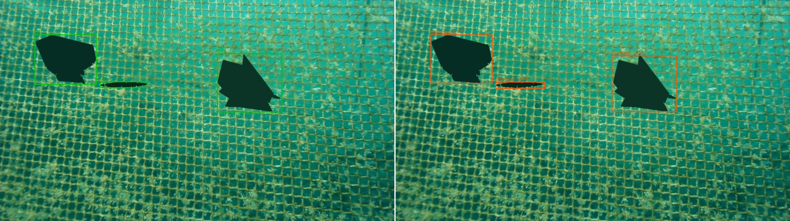 | 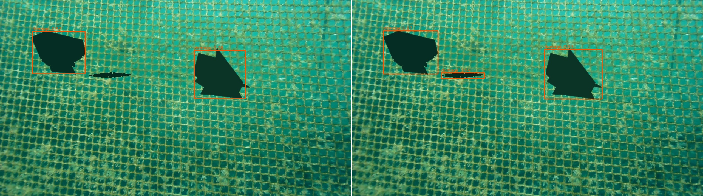 |

| PatchCore (foundation, label-free): boxes \| anomaly heatmap | Temporal: raw (left) vs. persistence-confirmed (right) |
|---|---|
| 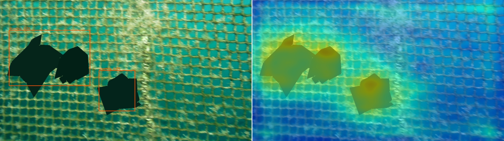 | 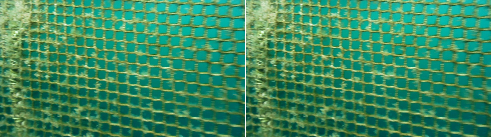 |

**Method comparison** (synthetic damage on real backgrounds; IoU 0.30, class-agnostic):

| Method | Labels? | In-clip F1 | Cross-clip F1 (held-out clip) |
|---|---|---|---|
| Hand-crafted anomaly (Mahalanobis) | no | 0.12 | 0.05 |
| Classical (OpenCV heuristic) | no | 0.50 | 0.67 |
| **PatchCore (foundation-model, label-free)** | no | **0.78** | — |
| **YOLOv8 (supervised)** | yes | **0.97** | **0.98** |

**Adversarial "is it cheating?" check** — the trained YOLO on **real undamaged
net** (no damage present, so any detection is a false alarm):

| Frame set | det v1 | seg v3 | seg-gpu |
|---|---|---|---|
| bag1 — the backgrounds it trained on (38 frames) | **0%** | 0% | 0% |
| bag2 — same site, other clip (120) | **0%** | 2.5% | 0% |
| **bag3 — same DAY, third clip (199)** | **31%** | 12% | 2.5% |
| different day (200) | **1%** | 18% | 11% |

**Read the third row before the fourth.** An earlier version of this table omitted
bag3 entirely — the evaluation set happened to contain the two clean same-day clips
and not the dirty one, so "0% on its own training backgrounds" was true of the
subset and false of the day. That is a sampling artifact of my own making, the same
class as the 1%→11% one recorded in §5.7, and it is the third such correction in
this project. All four undamaged clips on disk are now evaluated
(`scripts/adversarial_eval.py`).

The corrected numbers say something more interesting than the original claim did.
bag1, bag2 and bag3 are the **same day, same site, same camera**, flown at
near-identical commanded standoff (0.65 / 0.60 / 0.60 m — verified against the ROV
telemetry in `scripts/extract_telemetry.py`). Two of them produce zero false alarms
and one produces 31%. **The between-clip spread on one day is roughly thirty times
the different-day effect.** Whatever these models are sensitive to, it is a property
of the scene, not of the calendar — which is why the pre-registered hypothesis that
standoff distance explained the different-day gap was tested and **rejected**
(`scripts/analyze_operating_envelope.py`).

It also means the per-frame confidence intervals in this repo are too narrow.
Frames within a clip are strongly correlated (ICC ≈ 0.31 for the detector), so 638
frames carry roughly **13 frames' worth of independent information**. The honest
interval on the detector's overall false-alarm rate is the clip-clustered
**[0.00, 0.25]**, not the naive per-frame [0.08, 0.12].

**Temporal confirmation** removes a further **70%** of transient false alarms on
real undamaged video.

**Closing the different-day gap — a precision/recall trade-off (measured on 200
frames).** The nano segmenter fires on 18% of *different-day* undamaged frames (vs
the detector's 1%). Two honest options, opposite ends of the operating curve:

| Held-out different day (200 frames) | det v1 | seg v3 | **ensemble (det∧seg)** | **seg-gpu (A100)** |
|---|---|---|---|---|
| Undamaged false-positive rate | 1% | 18% | **0%** | 11% |
| Damage recall (F1) | 0.56 | 0.93 | 0.57 | **0.98** |

The **ensemble** (detector proposes, segmenter confirms) drives false alarms to
**0%** and adds masks, but inherits the detector's caution (~0.57 recall — it only
confirms damage the detector already found). The bigger **`seg-gpu`** catches
**0.98** of the damage at an 11% false-alarm cost. Pick by which error is more
expensive — a *missed defect* or a *false alarm*. (Recall here is on synthetic
damage and a small split, so it's a noisy proxy.)

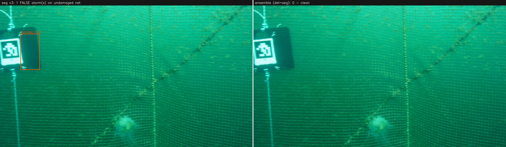

*Real different-day undamaged net. **Left:** `seg v3` false-alarms on an instrument
housing. **Right:** the det∧seg ensemble stays clean — same frame, no retraining.*

> **Read these honestly.** Synthetic metrics only verify the pipeline. SOLAQUA
> frames are real but **undamaged/unlabelled** (false-alarm & anomaly behaviour
> only). The YOLO numbers are on **synthetic damage composited on real
> backgrounds** — the *damage appearance* comes from one generator (same in
> train and test) and the cross-clip set is the same site/camera, so this shows
> "learns this damage model and transfers across clips/backgrounds", **not**
> "detects real damage." Real labelled damage is still required to claim
> real-world performance. Full detail in the [report](reports/PROTOTYPE_REPORT.md).

## Results (figures)

Generated from the committed result JSONs by `python scripts/make_plots.py`
(figures in [`reports/results/plots/`](reports/results/plots/)).

| Label-free → supervised ladder | Detection metrics by method |
|---|---|
| 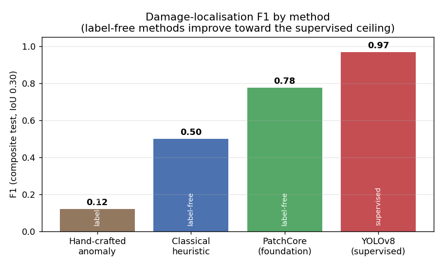 | 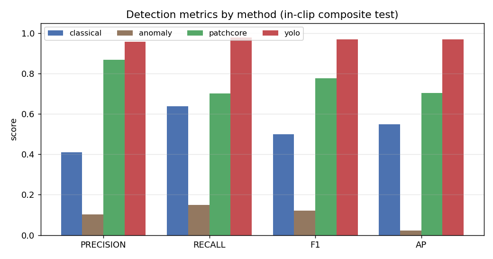 |

| Adversarial: FP on REAL undamaged net (det v1 vs seg v2/v3/v4) | FROC operating curve (det v1 vs seg v2/v3/v4) |
|---|---|
| 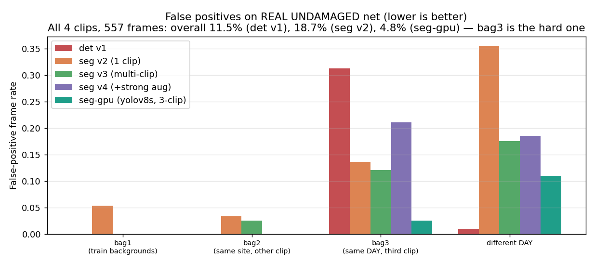 | 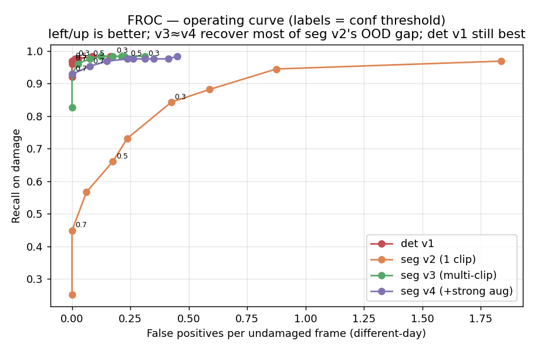 |

| Ensemble recovers det-v1 robustness + keeps masks | OOD gate defers the unfamiliar frames to a human |
|---|---|
| 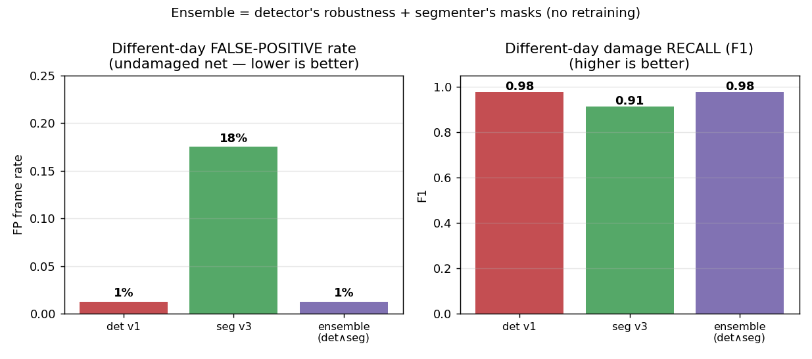 | 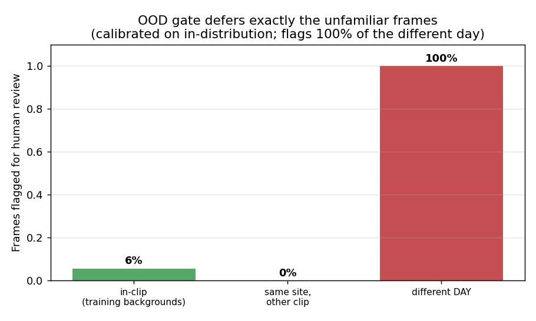 |

| Temporal confirmation removes ~70% of transient false alarms |
|---|
| 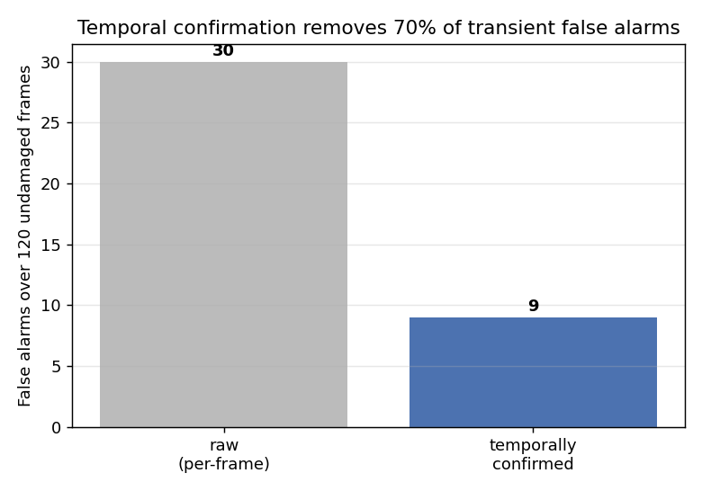 |

The robustness story, end to end: the first segmentation model (`seg v2`) regressed
badly out-of-distribution (31% different-day false alarms) — a failure the
evaluation **caught**. Multi-clip training (`seg v3`) cut that to **18%**; a
**stronger-augmentation** follow-up (`seg v4`) **failed** to improve it (22% — kept
as an honest negative); and a bigger **YOLOv8s-seg on a GPU** (`seg-gpu`) reached
the **best recall (0.98)** at an 11% false-alarm cost. The honest conclusion is a
**precision/recall trade-off**, not a single winner: the **det v1 / ensemble** end
(0–1% false alarms, lower recall) vs the **seg-gpu** end (0.98 recall, 11% false
alarms) — chosen by which error costs more. (One flattering 1% number along the way
turned out to be a small-sample artifact, re-checked on 200 frames and corrected.)
Separately, a label-free **backbone ablation** for the anomaly detector
(`reports/results/ssl_dino/`): off-the-shelf **DINOv2** features are competitive and
cleaner than ImageNet-ResNet18 but not a free OOD win; and **domain SSL** — a
**SimCLR ResNet18 I pretrained from scratch on the unlabelled SOLAQUA frames**
(`ssl_pretrain.py`) — *underperforms* both (AUROC 0.80/0.61 vs 0.98/0.82 and
1.00/0.93), an honest reminder that self-supervised learning needs scale (508 frames
isn't it; the GPU path to the full video is built in).

## Usage cases

**1. Screen inspection video for suspicious regions (offline review).**
```powershell
python scripts/infer.py --method yolo --yolo-weights models/yolo_damage_v1.pt --source clip.mp4 --out outputs/review --every-n 5
# fewer false alarms via temporal confirmation on a contiguous sequence:
python scripts/run_temporal.py --method yolo --yolo-weights models/yolo_damage_v1.pt --source data/processed/frames --out outputs/review_temporal
```

**1b. Live camera / ROV feed (real-time).** `live_inspect.py` runs any method on an
**RTSP/HTTP IP camera, a USB webcam, or a video file**, confirms defects over time
(one alert per *persisting* defect, not per frame), and flags out-of-distribution
frames for human review:
```powershell
# RTSP/ROV stream, ensemble detector, live window + event log:
python scripts/live_inspect.py --source rtsp://CAMERA_IP/stream --method ensemble \
    --yolo-weights models/yolo_damage_v1.pt --seg-weights models/yolo_damage_seg_v3.pt \
    --patchcore-model models/patchcore_normal_net --display --out outputs/live
# USB webcam 0:  --source 0     # any video file:  --source clip.mp4
```
Emits `damage_confirmed` events (`events.jsonl`) with bbox, score and an `ood_review`
flag. For a ROS-publishing ROV, swap the source for an `rclpy`/`rospy` image
subscriber and call the same facade per message (see `solaqua.py` for the pattern).

**1c. Turn a completed pass into a map (where is it, how big, what was missed).**
```powershell
python scripts/map_inspection.py --clip 2024-08-22_14-29-05
python scripts/map_inspection.py --clip 2024-08-22_14-29-05 --method seg_gpu --merge-radius 0.4 --no-figure
```
Writes a map JSON with every detection placed in metres along/across the net,
its size in mm, a drift estimate, the distinct sites repeat sightings collapse
to, and the coverage gaps. Needs a frame index for the clip and its `_data.bag`
telemetry (see §"Where is it?").

**2. Only have *normal*-net footage, want to flag anything unusual (label-free).**
```powershell
python scripts/train_patchcore.py --images data/processed/normal_frames --out models/patchcore_mynet
python scripts/run_anomaly.py --images data/processed/new_frames --model models/patchcore_mynet --out outputs/anomaly   # heatmaps + boxes
```

**3. Have labelled damage → train and rank approaches.**
```powershell
python scripts/prepare_data.py --images data/raw/images --labels data/raw/labels --out data/processed --yolo-split
python scripts/train_yolo.py --data data/processed/yolo/dataset.yaml --epochs 60
python scripts/compare_methods.py --images <test_imgs> --labels <test_lbls> --yolo-weights runs/detect/train/weights/best.pt --out outputs/comparison
```

**4. Decide whether to trust a model (before deploying).**
```powershell
python scripts/adversarial_eval.py --yolo-weights models/yolo_damage_v1.pt --out reports/results/adversarial   # FP on undamaged + FROC
# Combine the robust detector with the segmenter (det proposes, seg confirms):
python scripts/eval_ensemble.py --det models/yolo_damage_v1.pt --seg models/yolo_damage_seg_v3.pt --out reports/results/ensemble
# Out-of-distribution gate — flag unfamiliar frames for human review:
python scripts/eval_ood_gate.py --patchcore-model models/patchcore_normal_net --out reports/results/ood_gate

# Subtle-damage stress test (--hard = small, low-contrast damage) + sensitivity dial:
python scripts/make_real_dataset.py --frames data/processed/solaqua_diffday --out data/processed/hard_composite --hard
python scripts/eval_sensitivity.py --yolo-weights models/yolo_damage_seg_gpu.pt \
    --composited data/processed/hard_composite/images/test data/processed/hard_composite/labels/test \
    --undamaged data/processed/solaqua_diffday --out reports/results/sensitivity_hard   # recall vs false-alarms by conf
python scripts/make_plots.py        # turn results into figures
```

**5. Serve / explore.**
```powershell
python scripts/serve.py --yolo-weights models/yolo_damage_v1.pt --patchcore-model models/patchcore_normal_net   # HTTP API
streamlit run streamlit_app.py      # interactive viewer
```

---

## The problem

Fish-farm nets develop holes, tears, deformations and abnormal regions over
time. Detecting them early matters: undetected damage risks fish escape, with
operational, financial and environmental consequences. Today this is largely a
manual review task — an operator or ROV pilot watches underwater camera footage
and judges whether something looks wrong.

The question this prototype explores is: **can computer vision flag suspicious
regions in net footage to support (not replace) human inspection?**

### Why it is hard

This is not a clean image-classification problem. A real system must cope with:

- **Underwater optics** — light attenuation, colour casts, turbidity, backscatter.
- **Variable conditions** — lighting, camera distance/angle, net deformation, motion blur.
- **Confounders** — marine growth/biofouling, ropes, shadows, fish occlusion, background structure.
- **Data scarcity & imbalance** — damage is rare; most frames are intact net.
- **Ambiguous labels** — "damage" is partly a judgement call; annotators disagree.
- **Asymmetric error costs** — false positives waste operator time; false negatives can miss real damage. The acceptable trade-off is a *business* decision, not a default.

These are exactly the reasons the prototype favours **explainable baselines,
careful evaluation, and visual failure analysis** over a single black-box model.

---

## Proposed workflow

The repo is organised around the workflow I would actually follow on the job:

1. **Inspect & understand the data** — counts, sizes, class balance, label sanity (`prepare_data.py`).
2. **Define labels** — agree damage classes and a labelling guideline with domain experts (`configs/`).
3. **Classical baseline first** — a fast, explainable OpenCV method to gauge how separable damage is and to surface data difficulty (`run_classical_baseline.py`).
4. **Train a detection/segmentation baseline** — YOLOv8 / YOLOv8-seg once labelled data exists (`train_yolo.py`).
5. **Evaluate false positives / false negatives** — precision/recall/F1/AP, image-level decisions, confidence sweeps, per-image failure overlays (`evaluate.py`).
6. **Produce a prototype + recommendations** — a report covering assumptions, results, limitations and next steps (`reports/`).

---

## Three compared approaches

| | Classical baseline | Anomaly baseline | ML baseline |
|---|---|---|---|
| **Module** | `classical_baseline.py` | `anomaly.py` | `model_baseline.py` (YOLOv8) |
| **Idea** | Net = regular mesh; damage breaks it. **Darkness** cue + **low-edge-density** cue + a **texture gate** to reject dark-but-textured net. | Learn "normal net" patch statistics; flag Mahalanobis outliers. | Learn damage appearance from labelled examples. |
| **Needs labels?** | No | No (only normal frames) | Yes (YOLO det/seg) |
| **Pros** | Fast, transparent, no training data. Triage / difficulty probe. | No damage labels needed; localises "unusual net". | Learns appearance; far higher ceiling (F1≈0.97 here). |
| **Cons** | Brittle; tops out ~F1 0.5 on real backgrounds. | Flags fouling/lighting too; weak box localiser. | Needs representative labelled data; less interpretable. |

The classical and anomaly methods are **screening / difficulty probes**; the ML
path is the route to real performance once labelled data exists. All three share
one prediction schema and are compared with the same metrics (`compare_methods.py`).

---

## Repository layout

```
net-inspection-cv/
  README.md                      this file
  pyproject.toml                 packaging + optional deps (cv / ml / dev)
  requirements.txt               pinned-ish runtime deps
  configs/
    baseline.yaml                classical + preprocessing + eval params
    yolo_dataset.yaml            YOLO dataset config (placeholder)
  src/netinspect/
    data.py                      dataset discovery, YOLO label parsing, summaries
    preprocess.py                CLAHE, white balance, denoise, resize
    classical_baseline.py        explainable OpenCV anomaly baseline
    model_baseline.py            YOLOv8 detect/segment wrapper (graceful if missing)
    anomaly.py                   normal-net anomaly model (patch Mahalanobis)
    patchcore.py                 foundation-model anomaly (pretrained-CNN PatchCore)
    dino_backbone.py             self-supervised DINOv2 backbone for PatchCore (SSL-vs-supervised ablation)
    ssl_pretrain.py              from-scratch SimCLR — domain-pretrain a ResNet18 on unlabelled SOLAQUA
    ensemble.py                  det-proposes / seg-confirms agreement ensemble (det-v1 robustness + masks)
    ood_gate.py                  out-of-distribution gate — defer unfamiliar frames to human review
    temporal.py                  IoU tracker — confirm detections that persist
    mapping.py                   net-frame localisation: visual odometry, self-calibrating scale, coverage
    live.py                      real-time camera/RTSP/ROV capture + inference (threaded, drops stale frames)
    netmodel.py                  place a measured strip on a declared sea cage; coverage vs the whole net
    cli.py                       the `netinspect` command — the front door for everything below
    dataset.py                   bring-your-own-data: ingest, audit, leakage-safe grouped split
    acceptance.py                release gate + threshold calibration against an operating point
    compose.py                   composite photorealistic damage + hard negatives onto REAL frames
    inference.py                 unified facade over all methods (used everywhere)
    onnx_infer.py                ONNX Runtime inference path
    evaluate.py                  detection / segmentation / image-level metrics
    visualize.py                 overlays, comparisons, galleries
    video.py                     video frame extraction
    solaqua.py                   SOLAQUA client + ROS-bag camera & sonar extraction
    telemetry.py                 13 canonical ROV streams from the data bags, sensor-suite drift normalised
    frame_sync.py                recover frame timestamps and join frames to telemetry on the bag clock
    envelope.py                  operating-envelope gate — when is a frame's verdict trustworthy
    image_quality.py             per-frame capture quality (sharpness, contrast, brightness, saturation)
    sites.py                     Fiskeridirektoratet locality register
    ocean.py                     MET Norway ocean forecast + cod thermal optimum
    warehouse.py                 DuckDB view layer over every artifact
    assistant/                   grounded tool-calling Q&A: evidence ledger, tools, backends, eval suite
    coco.py                      COCO -> YOLO adapter (real labelled data drop-in)
    synthetic.py                 placeholder data generator (testing only)
    utils.py                     IO, geometry, optional-dependency handling
  scripts/                       CLI entry points (see below)
                                 incl. make_cage_gif.py / make_temporal_gif.py /
                                 make_workflow_figure.py — every README figure and
                                 animation regenerates from the code it documents
  web/                           interactive console (index.html / style.css / app.js)
                                 + net3d.js (3-D cage viewer), net3d.test.mjs, net3d.render.mjs
  streamlit_app.py               alternative interactive viewer
  models/                        committed prototype models (.pt/.npz/.onnx) + NOTICE
  Dockerfile                     CPU container (written, NOT built — see the file header)
  operating_point.example.yaml   the acceptance contract the release gate enforces
  .github/workflows/ci.yml       CI: run tests on push/PR
  tests/                         pytest: data loading + metrics
  reports/PROTOTYPE_REPORT.md
  data/  outputs/  runs/         data, predictions, visualisations, training runs
```

---

## Licensing — the code is MIT, the shipped weights are not

This matters more than anything else on this page if you are evaluating it for
commercial use, so it is not buried in a footer:

| | |
|---|---|
| all source code | **MIT** |
| the committed `.pt` / `.npz` weights | derived from Ultralytics YOLOv8 (**AGPL-3.0**) and SOLAQUA data (**CC BY-SA 4.0**) |

**AGPL-3.0 is viral over a network**, and running `netinspect serve` is exactly
the network use that triggers it. Most corporate legal teams block AGPL for that
reason; Ultralytics sells a commercial licence that removes it.

The pipeline is the deliverable and the weights are a demonstration — so the
clean position is to retrain from a permissively-licensed detector on your own
footage, which is what the next section is about. Full detail in
[`models/NOTICE.md`](models/NOTICE.md). Not legal advice; a statement of what the
upstream licences say, so the question reaches your counsel before your product.

## Use it on your own footage

Everything above is measured on public data. The point of the toolkit is what
happens when **you** bring labelled footage from your own sites. One command per
step, and the last one can refuse.

```bash
pip install -e ".[cv,ml,serve]"

netinspect doctor                              # what's installed, what's missing
netinspect onboard ./my_footage --out data/mysite
netinspect train    --data data/mysite/dataset.yaml --epochs 80
netinspect calibrate --data data/mysite --weights runs/detect/train/weights/best.pt
netinspect gate      --data data/mysite --weights runs/detect/train/weights/best.pt \
                     --operating-point operating_point.yaml
```

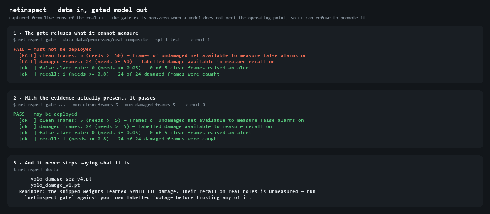

*Captured from live runs against the labelled dataset in this repo
(`python scripts/make_workflow_figure.py`). Same model, same data, both
outcomes: at default thresholds the gate **refuses** because 5 clean frames
cannot support a false-alarm rate, and exits 1. Told explicitly that 5 is
acceptable, it passes — 24 of 24 damaged frames caught, 0 of 5 clean frames
alarmed. The exit code is the point: CI can act on it.*

**`onboard`** takes whatever your annotation tool exports — YOLO `.txt`, COCO
`.json`, Pascal VOC `.xml`, or images with no labels at all — detects the format,
audits it, and writes a trainable dataset plus a `data_health.json`. It splits
**grouped by clip** by default, because inspection footage is video: a random
image-level split puts frame 100 in train and frame 101 in test, and returns an
F1 of 0.99 that means nothing. It also perceptually hashes every frame to catch
the same footage exported twice under different names — grouping does not catch
that, and nothing else will tell you.

It **refuses** rather than quietly proceeding: pixel coordinates in a normalised
field, zero-area boxes, or too few clips to form three splits all stop it, with
the offending files named.

**`calibrate`** picks the confidence threshold on *your* validation split against
a false-alarm budget you set. This is the largest honest accuracy gain available
without collecting more data — and the repo default of 0.25 was tuned on SOLAQUA
footage, so on your camera and water it is close to arbitrary.

**`gate`** is the one that matters. It measures the model against an operating
point you wrote down *beforehand* (see
[`operating_point.example.yaml`](operating_point.example.yaml)) and **exits
non-zero** if it does not meet it, so CI can refuse to promote it:

```
FAIL — must not be deployed
  [ok  ] clean frames: 28 (needs >= 20)
  [ok  ] damaged frames: 10 (needs >= 5)
  [ok  ] false alarm rate: 0 (needs <= 0.05)
  [FAIL] recall: 0 (needs >= 0.8) — 0 of 10 damaged frames were caught
```

It **fails closed**. A test set with no clean frames cannot produce a
false-alarm rate, and the gate treats "not measurable" as a failure rather than
a pass — silence there is exactly how an unvalidated model reaches a boat. It
also refuses to certify on a handful of frames, because a rate over eight images
is noise wearing a percentage sign.

Why the primary axis is **frame-level false alarms** rather than mAP: a crew
watching a screen abandons a system that cries wolf, so the number that decides
whether this gets used at all is *what fraction of clean frames raised an
alert*. Recall is second, and meaningless without the first — a detector that
fires on everything has perfect recall.

> **What this does and does not give you.** The engineering is production-shaped:
> one CLI, a data audit that refuses bad input, a release gate with an exit code,
> an OOD gate for unfamiliar domains, health/readiness/metrics endpoints, and a
> container. The **shipped weights are not a validated product** — they learned
> synthetic damage and their recall on real holes has never been measured. Run
> `netinspect gate` against your own labelled footage; if it fails, that is the
> tool working. Shadow-mode first, then alerting.

### Running it on a network

The service is **secure by default and refuses to be published insecurely**.

```bash
export NETINSPECT_API_KEY=$(openssl rand -hex 24)
export NETINSPECT_LIVE_ALLOW='rtsp://cam-*.farm.local/*'
export NETINSPECT_MEDIA_ROOT=/srv/inspection/clips
netinspect serve --host 0.0.0.0

# then open the console WITH the key — it is stored per-session and stripped
# from the address bar, so it does not linger in browser history:
#   http://your-host:8000/?key=$NETINSPECT_API_KEY
```

Without a key it will **not bind anything but loopback** — local development
still just works, but publishing an unauthenticated inference endpoint is not
something you can do by forgetting:

```
Refusing to bind 0.0.0.0 without authentication.
Set NETINSPECT_API_KEY to a secret, or bind 127.0.0.1 for local use.
```

`POST /api/live/start` used to take a free-form source string and hand it to
OpenCV — a read of any file the process could open and an outbound request to
anywhere the host could reach. It is now **default-deny**: camera indices, files
under `NETINSPECT_MEDIA_ROOT`, and URLs matching `NETINSPECT_LIVE_ALLOW`.
Private, loopback and link-local addresses are refused *even when a pattern
matches*, because `169.254.169.254` is the standard route from "can reach an
internal endpoint" to "has your cloud credentials".

| variable | effect |
|---|---|
| `NETINSPECT_API_KEY` | required on every `/api` and `/predict` route (`/api/health`, `/api/ready` stay open for load balancers) |
| `NETINSPECT_LIVE_ALLOW` | comma-separated glob patterns of permitted stream URLs |
| `NETINSPECT_MEDIA_ROOT` | directory live video files may be opened from |
| `NETINSPECT_CORS_ORIGINS` | comma-separated origins; same-origin only if unset |
| `NETINSPECT_MAX_PIXELS` | decompression-bomb ceiling (default 50 MP) |
| `NETINSPECT_MAX_CONCURRENCY` | simultaneous inferences before requests queue, then 503 |

`GET /api/version` reports the service version, the git commit, and a **SHA-256
digest of every model file** — so an inspection report can be tied to the exact
artefacts that produced it, which a version string alone cannot do.

Still needed for a hardened deployment, and deliberately not faked here: TLS and
rate limiting via a reverse proxy, and a lock file for reproducible builds. It is
single-process, so the in-memory metrics do not aggregate across workers.

A container is provided in [`Dockerfile`](Dockerfile), but note it has **not been
built or run** — no Docker daemon was available where it was written, and CI does
not build it either.

## Installation

Python 3.10+ (developed and verified on 3.14). Core data/metric code needs only
NumPy/Pandas/Pillow; OpenCV and Ultralytics are **optional** and the code
degrades gracefully without them.

```powershell
python -m venv .venv
.\.venv\Scripts\Activate.ps1            # Windows; use source .venv/bin/activate on Linux/Mac
pip install -e ".[cv,ml,data,serve,dev]"  # cv=OpenCV; ml=ultralytics/torch; data=rosbags; serve=FastAPI/Streamlit
```

**GPU training (Colab).** Heavy runs (multi-clip, bigger `yolov8s/m-seg`, longer
schedules) are slow on CPU. [`notebooks/colab_train_gpu.ipynb`](notebooks/colab_train_gpu.ipynb)
runs the identical pipeline on a Colab GPU — clone → pull SOLAQUA → rebuild the
composited dataset → train → held-out adversarial eval → download weights — in
minutes, and sketches the GPU-only **SSL-pretraining-on-SOLAQUA** next step.

If you only want the classical baseline + evaluation: `pip install -e ".[cv,dev]"`.
Extras are modular: `data` (rosbags, for SOLAQUA `.bag`), `ml` (YOLO), `serve`
(API + viewer) are each optional and degrade gracefully when absent.
If `ultralytics` is unavailable, the YOLO scripts print clear guidance instead of crashing.

---

## Quick start — the demo path (synthetic data)

This runs the whole pipeline end-to-end on generated placeholder data:

```powershell
# 1. Generate synthetic net images with injected "damage" (+ YOLO labels)
python scripts/make_demo_data.py --out data/sample --n 10

# 2. Inspect the dataset (counts, sizes, class balance, label errors)
python scripts/prepare_data.py --images data/sample/images --labels data/sample/labels --out data/processed

# 3. Run the classical baseline -> predictions + overlays
python scripts/run_classical_baseline.py --images data/sample/images --out outputs/classical --config configs/baseline.yaml

# 4. Evaluate against ground truth -> metrics + failure overlays
python scripts/evaluate.py --preds outputs/classical/preds.json --images data/sample/images --labels data/sample/labels --out outputs/eval

# 5. Collect report assets (gallery, failure cases, metrics.json) in one command
python scripts/make_report_assets.py
```

> **Reminder:** the synthetic demo only verifies that the pipeline works.
> It does **not** prove real aquaculture performance.

### Running the ML (YOLO) path

```powershell
# Build a YOLO train/val split (also writes a ready-to-use dataset.yaml)
python scripts/prepare_data.py --images data/sample/images --labels data/sample/labels --out data/processed --yolo-split

# Train (needs ultralytics). On real data use more epochs / a larger model.
python scripts/train_yolo.py --data data/processed/yolo/dataset.yaml --epochs 50

# Inference with trained weights, then evaluate the same way as the classical path
python scripts/run_inference.py --images data/processed/images --weights runs/detect/train/weights/best.pt --out outputs/predictions
python scripts/evaluate.py --preds outputs/predictions/preds.json --images data/processed/images --labels data/processed/labels --out outputs/eval
```

### Real data — SOLAQUA (SINTEF)

[SOLAQUA](https://data.sintef.no/product/dp-7141fcd5-0fb8-4be3-b9ce-e5f7f5bb4a58)
([paper](https://arxiv.org/abs/2504.01790), CC BY-SA 4.0) is real ROV footage of
operational Norwegian net pens. The camera data is inside ROS `.bag` files and
the nets are **undamaged with no damage labels**, so we use it honestly: real
preprocessing, false-positive analysis, and anomaly detection.

```powershell
# List files (sizes), then download the smallest video bag and extract ~40 frames
python scripts/fetch_solaqua.py --list
python scripts/fetch_solaqua.py --smallest-video --frames-out data/processed/solaqua_frames

# (a) Robustness / false-positive analysis: nets are undamaged, so every
#     classical-baseline detection is a false alarm. This quantifies that.
python scripts/run_real_analysis.py --images data/processed/solaqua_frames --out outputs/real_analysis --config configs/baseline.yaml

# (b) Anomaly detection: learn "normal net", flag deviations (heatmaps + boxes)
python scripts/train_anomaly.py --images data/processed/solaqua_frames --out outputs/anomaly/model
python scripts/run_anomaly.py --images data/processed/solaqua_frames --model outputs/anomaly/model --out outputs/anomaly
```

Observed on 38 extracted frames (real, undamaged net): the classical baseline
raises a false alarm on **~76% of frames** (≈3 detections/frame), and the
anomaly model's heatmaps light up on **biofouling and lighting hotspots** — both
honest illustrations of why a naive heuristic is insufficient and why a learned
model plus a calibrated FP/FN threshold are needed. These numbers describe
false-alarm behaviour on undamaged net; they are **not** damage-detection
metrics (there is no damage to detect here).

### Train a realistic detector (synthetic damage on real backgrounds) + compare

When real labelled damage isn't available, we composite plausible damage onto
**real** SOLAQUA net frames (real texture/biofouling/lighting; labelled
holes/tears) to get a believable training/eval set — clearly not real damage.

```powershell
# Composite damage onto real frames -> YOLO train/val/test (disjoint backgrounds)
python scripts/make_real_dataset.py --frames data/processed/solaqua_frames_dense --out data/processed/real_composite

# Train YOLOv8 on real backgrounds, then compare all 3 methods on the test split
python scripts/train_yolo.py --data data/processed/real_composite/dataset.yaml --epochs 60 --imgsz 480
python scripts/compare_methods.py --images data/processed/real_composite/images/test \
    --labels data/processed/real_composite/labels/test --config configs/baseline.yaml \
    --anomaly-model outputs/anomaly/model --yolo-weights runs/detect/train/weights/best.pt \
    --out outputs/comparison
```

Measured: **YOLO F1 ≈ 0.97** vs classical **0.50** vs anomaly **0.12**, holding up
on a held-out clip (F1 ≈ 0.98) — see the caveats above and in the report.

### Stronger methods + rigorous evaluation

```powershell
# Foundation-model anomaly (label-free, F1 ~0.78): pretrained-CNN PatchCore
python scripts/train_patchcore.py --images data/processed/solaqua_frames_dense --out models/patchcore_normal_net

# Self-supervised vs supervised features (same detector, only the backbone differs):
python scripts/train_patchcore.py --images data/processed/solaqua_frames_dense --backbone dinov2_vits14 --out models/patchcore_dino_vits14
python scripts/compare_anomaly_backbones.py --models resnet18=models/patchcore_resnet18 dinov2=models/patchcore_dino_vits14 --out reports/results/ssl_dino

# Domain SSL: SimCLR-pretrain a ResNet18 on the UNLABELLED SOLAQUA frames (GPU=minutes),
# then use that backbone in PatchCore vs ImageNet-supervised vs off-the-shelf DINOv2:
python scripts/pretrain_ssl.py --frames data/processed/solaqua_frames_dense data/processed/solaqua_bag2 data/processed/solaqua_bag3 --epochs 400 --batch 256 --device cuda --out models/ssl_resnet18_solaqua.pt
python scripts/train_patchcore.py --images data/processed/solaqua_frames_dense --backbone-weights models/ssl_resnet18_solaqua.pt --out models/patchcore_ssl_solaqua

# Adversarial "is it cheating?" suite: FP on REAL undamaged net + different-day + FROC
python scripts/adversarial_eval.py --yolo-weights models/yolo_damage_v1.pt --out reports/results/adversarial_yolo

# Temporal confirmation on a CONTIGUOUS sequence: removes ~70% of transient false alarms
python scripts/fetch_solaqua.py --bag <clip>.bag --frames-out data/processed/solaqua_seq --every-n 1 --max-frames 120
python scripts/run_temporal.py --method classical --source data/processed/solaqua_seq --out outputs/temporal --config configs/baseline.yaml
```

Committed result tables: [`reports/results/`](reports/results/) — 4-method
comparison, adversarial eval, temporal.

### Ingesting real labelled data (COCO) + deployment export

```powershell
# Real labels usually arrive as COCO -> convert to YOLO (the drop-in slot for
# an operator's eventual labelled damage). Also handles SeaClear/TrashCan etc.
python scripts/convert_coco.py --coco anns.json --images imgs --out data/processed/real --single-class
python scripts/train_yolo.py --data data/processed/real/dataset.yaml --epochs 60

# Export to ONNX (portable; TensorRT/INT8 on-device) + latency benchmark
python scripts/export_onnx.py --weights models/yolo_damage_v1.pt --imgsz 480
```

> **Honest note on public datasets.** SeaClear / TrashCan / Trash-ICRA19 are
> marine *debris* (plastic, animals, plants) — useful as a real-image smoke test
> of the COCO adapter and for transfer/pretraining, **not** a net-damage proxy.
> Verify each dataset's licence before downloading. The COCO adapter exists so
> that *real labelled net-damage data* drops straight in when it's available.
>
> **Deployment.** ONNX export works and is benchmarked
> ([`reports/results/onnx_benchmark.json`](reports/results/onnx_benchmark.json));
> on this CPU dev box ONNX Runtime wasn't faster than PyTorch — the real speedup
> is **TensorRT (FP16/INT8) on the target device** (e.g. Jetson), which is
> documented rather than run here (needs the device + calibration data).

### Tuning classical false positives

The classical baseline's `max_region_density_ratio` (texture gate) trades recall
for fewer false alarms on real net. Lowering it from the untuned setting cut
false detections on undamaged frames **~46–75%** (config `configs/baseline.yaml`).

### Serve it (HTTP API) and explore it (Streamlit)

Trained prototype models are committed under `models/` (see `models/NOTICE.md` for
provenance/licensing), so the YOLO and anomaly paths run out of the box:

```powershell
# FastAPI inference service using the committed models
python scripts/serve.py --anomaly-model models/anomaly_normal_net --yolo-weights models/yolo_damage_v1.pt
# curl -F file=@frame.jpg "http://localhost:8000/predict?method=yolo"

# Or containerised (serves YOLO + anomaly + classical):
docker build -t net-inspection-cv . ; docker run -p 8000:8000 net-inspection-cv

# Interactive viewer: browse frames, switch methods, live thresholds
streamlit run streamlit_app.py

# Unified batch/video/bag inference for any method
python scripts/infer.py --method yolo --yolo-weights models/yolo_damage_v1.pt \
    --source data/processed/solaqua_frames --out outputs/infer
```

Measured results are committed under [`reports/results/`](reports/results/)
(in-clip and cross-clip method comparisons, real-frame false-positive analysis).

### Multi-modal: multibeam sonar

```powershell
python scripts/fetch_solaqua.py --bag data/raw/solaqua/<clip>.bag --sonar-out data/processed/sonar
```

Sonar (SonoptixECHO) decodes to a 512×512 intensity image — a complementary
modality that sees through turbidity. Experimental; not RGB damage detection.

### Working from video

```powershell
python scripts/extract_frames.py --video data/raw/video.mp4 --out data/processed/frames --fps 2
```

---

## What is implemented vs. placeholder

**Implemented and working:**

- Image/video ingestion, YOLO detection **and** segmentation label parsing, dataset summaries with invalid-label reporting.
- Underwater preprocessing (gray-world white balance, CLAHE, denoise, resize).
- Classical baseline producing boxes + scores + overlays + JSON/CSV.
- YOLOv8 detect/segment training & inference wrapper (graceful when ultralytics is absent).
- Evaluation: IoU-matched precision/recall/F1, VOC-style AP, confidence sweep, image-level "contains damage?", mask IoU, explicit FP/FN lists, failure overlays.
- Visualisation: prediction/GT overlays, colour-coded match overlays, markdown gallery.
- **Real-data ingestion (SOLAQUA)**: public-API client, resumable download, ROS `.bag` camera **and multibeam-sonar** extraction.
- **Two anomaly baselines**: hand-crafted patch-Mahalanobis, and a **foundation-model PatchCore** (pretrained CNN) reaching F1 0.78 label-free (6.5× the hand-crafted one).
- **Realistic training data**: photorealistic damage (seamless blend, frayed fibres) + **hard negatives** composited on real backgrounds (`compose.py`).
- **Four-method comparison** + a **measured improvement story** (classical FP reduction; PatchCore; YOLO F1≈0.97).
- **Adversarial "is it cheating?" evaluation**: false positives on real undamaged net, different-day generalization, FROC curve.
- **Temporal reasoning**: persistence tracking that removes ~70% of transient false alarms on real video.
- **Segmentation** (YOLOv8-seg) for masks; **COCO ingestion adapter** (real labelled data drops in); **ONNX export + latency benchmark**.
- **Interactive web console** (FastAPI + custom UI) with self-explanatory source/method descriptions and a live **OOD-gate badge**; Streamlit viewer; batch/video/bag runner; **`live_inspect.py`** real-time RTSP/USB/ROV streaming with temporal confirmation + per-defect alerts; per-class evaluation; CI.
- **Production-shaped serving:** path-traversal-safe, upload validation, structured logging + request IDs, `/health` `/ready` `/metrics`, no-leak error handling.
- **Torch-free ONNX inference** (`onnx_infer.py`, parity-verified) + a **streaming pipeline** (`stream_inspect.py`) that emits one confirmed-damage alert per new track.
- **Ops artifacts:** model card, deployment/SLO runbook, data-collection protocol, and a self-critical [production-readiness scorecard](reports/PRODUCTION_READINESS.md).
- Tests (61) for data, metrics, anomaly, compositing, inference, temporal, PatchCore, COCO, per-class, **service security/integration**, **ONNX**, the **DINOv2 backbone**, and **SimCLR pretraining**.

**Placeholder / synthetic (clearly marked):**

- `data/sample/` and the `synthetic.py` generator are **procedural placeholders**. Any metric computed on them measures the pipeline, not real-world skill.
- `configs/yolo_dataset.yaml` points at the demo split; classes are a starting point to be agreed with domain experts.
- The classical baseline parameters in `configs/baseline.yaml` are tuned for the synthetic data and **will need re-tuning (or replacing with the ML model) on real footage**.

---

## What a farm operator would need to provide to make this real

- **Representative footage** — images/video from real inspections across sites, seasons, depths, lighting and camera setups (ideally the operator's own inspection-camera or ROV streams).
- **Real damage examples** — actual holes/tears/abnormal regions, plus plenty of *normal* net under varied conditions.
- **Metadata where available** — camera type, site, depth, date/time, lighting, environment.
- **Labelling guideline + domain feedback** — what counts as "damage", class definitions, edge cases.
- **An agreed error trade-off** — acceptable false-positive vs false-negative rates for the intended use.
- **The deployment target** — real-time on-ROV, offline review, operator decision support, alerting, or integration with existing inspection software via its API.

See [`reports/PROTOTYPE_REPORT.md`](reports/PROTOTYPE_REPORT.md)
for the full write-up: assumptions, approach, results, failure modes and next steps.

---

## Tests

```powershell
pytest -q
```

## Data attribution

This prototype can download and process the **SOLAQUA** dataset:

> Ohrem, S. J., Haugaløkken, B. O. A., et al. *SOLAQUA: SINTEF Ocean Large
> Aquaculture Robotics Dataset.* SINTEF Ocean. Data:
> https://data.sintef.no/product/dp-7141fcd5-0fb8-4be3-b9ce-e5f7f5bb4a58 —
> arXiv:2504.01790. Licensed **CC BY-SA 4.0**.

SOLAQUA data is not redistributed in this repository; it is downloaded on demand
via `scripts/fetch_solaqua.py`. Any reuse must comply with CC BY-SA 4.0
(attribution + share-alike).

## License

MIT for this prototype's code. Downloaded SOLAQUA data remains under CC BY-SA 4.0.
